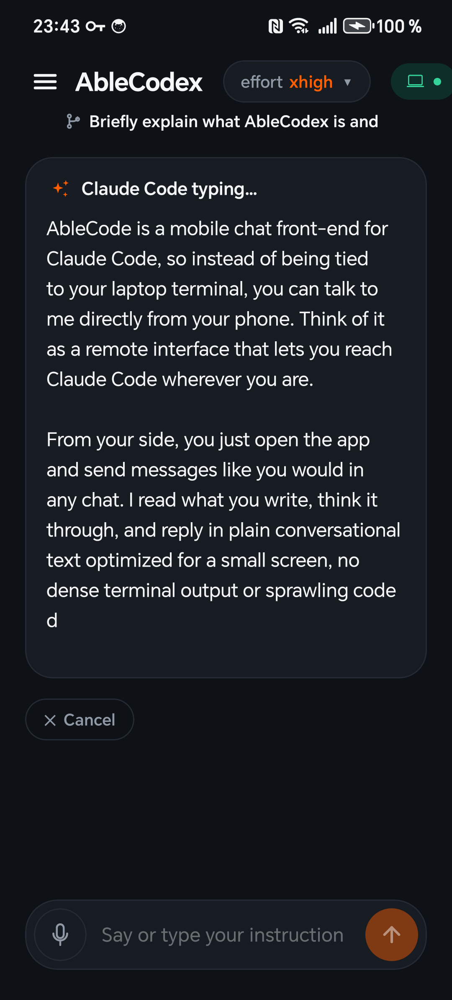
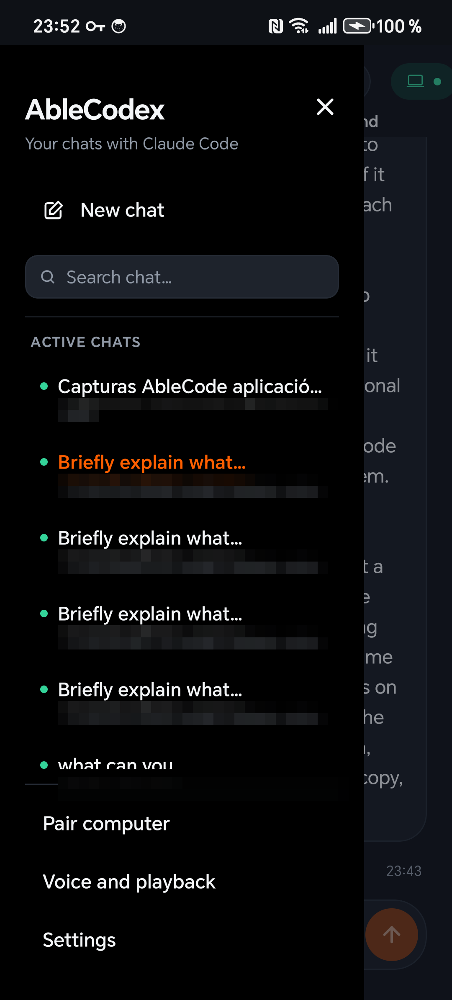
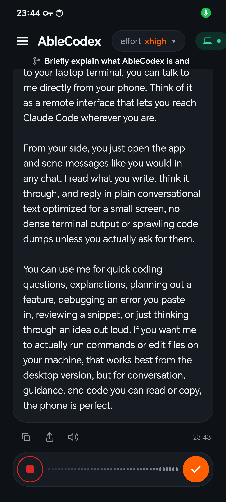
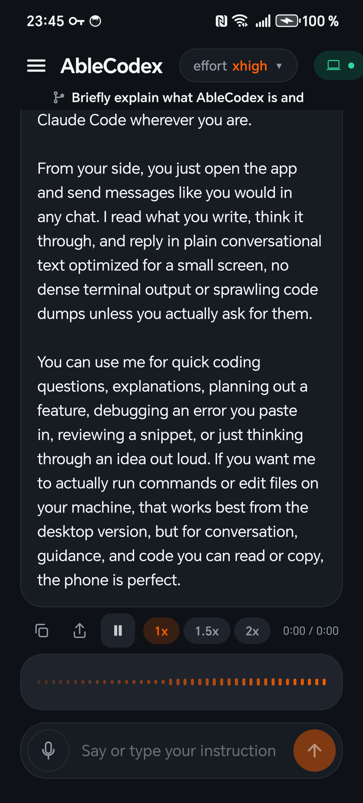
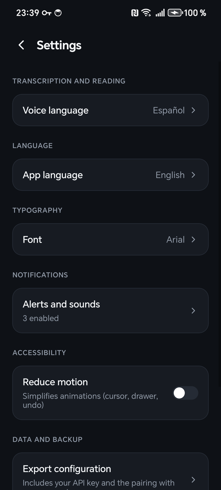
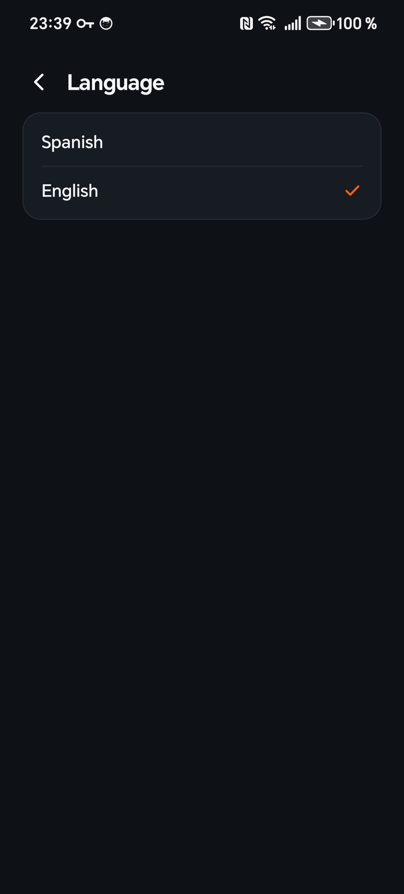

# AbleCodex

**Talk to Claude Code on your computer, from your phone.**

AbleCodex is an Android app that gives you a comfortable chat interface for [Claude Code](https://claude.com/claude-code) running on your laptop. Your phone stays in sync with every Claude Code session you have open on the computer — and with any new one you start — so you can dictate prompts, listen to replies, and switch between projects without sitting at your desk.

> **Status: closed beta — validating interest. Not yet downloadable.** AbleCodex is in active development. There's no APK, no installer, and no public source code yet — we're showing the documentation first to test how the value proposition reads. Pricing for the public release is TBD; the beta will be free for the first wave of users. **If what you see below sounds useful, [start a Discussion](https://github.com/AbleCodex/ablecodex/discussions) to request early access** — that demand is what decides whether we keep going.

---

## What you get

<table>
<tr>
<td width="50%" valign="top">

### A chat shaped for Claude Code

A clean Android UI built for one job: talking to Claude Code. Bubbles, reply cards, streaming text, copy and share — none of the friction of using a terminal on a phone.

</td>
<td width="50%" valign="top" align="center">

</td>
</tr>
<tr>
<td valign="top">

### Synced to your terminals

Your phone sees every Claude Code session you have open on the computer — the one you launched from a terminal an hour ago, plus any new one you start from the AbleCodex drawer. Switch between them with one tap.

</td>
<td valign="top" align="center">

</td>
</tr>
<tr>
<td valign="top">

### Voice input

Dictate prompts with the microphone — the waveform reacts to your voice as you speak. Android's built-in speech recognizer transcribes what you say; edit the text or send it straight away.

</td>
<td valign="top" align="center">

</td>
</tr>
<tr>
<td valign="top">

### Voice playback

Tap the speaker icon under any reply and Claude reads it back to you. Three speed pills (1x, 1.5x, 2x) work mid-playback. Use the phone's built-in text-to-speech for free, or link your own ElevenLabs account for a high-quality voice — AbleCodex falls back to the system voice if the API is unreachable.

</td>
<td valign="top" align="center">

</td>
</tr>
<tr>
<td valign="top">

### Settings you'll actually use

Pick the font you read best in, choose what fires a notification, reduce motion if animations bother you, export a backup of your configuration. Nothing you have to touch on day one; everything you might want on day thirty.

</td>
<td valign="top" align="center">

</td>
</tr>
<tr>
<td valign="top">

### One UI, two languages

Spanish and English live-switchable from Settings. The whole app re-renders instantly, and Claude follows the same language by default for new replies. More languages on the roadmap.

</td>
<td valign="top" align="center">

</td>
</tr>
</table>

---

## What you don't get

- **No screen mirroring.** AbleCodex is a chat app, not a remote desktop. If you want to see your laptop screen on your phone, pick something else.
- **No vendor lock-in.** Your chats live on your phone and on your computer. There is no AbleCodex cloud server in the middle of your conversation.
- **No surprise bills.** AbleCodex itself is free during the open beta. The Claude usage you'd have anyway from your computer is what costs money — AbleCodex doesn't add to it.

---

## Want early access?

AbleCodex isn't downloadable today. The way to get on the list:

1. Have [Claude Code](https://claude.com/claude-code) already installed on your computer (this is a hard prerequisite — AbleCodex is a remote control for it).
2. Open a thread in [Discussions](https://github.com/AbleCodex/ablecodex/discussions). Tell us your operating system, how you currently use Claude Code, and what you'd want from a phone client. A couple of sentences is enough.
3. Click **Watch** on the repo so you're notified when the first beta build lands.

We're being deliberate about who gets early access — the install is still rough and we'd rather have ten happy users than a hundred frustrated ones. Concrete interest is what tells us when to expand.

Full feature documentation lives in the [Wiki](https://github.com/AbleCodex/ablecodex/wiki).

---

## Links

- 📘 [Documentation Wiki](https://github.com/AbleCodex/ablecodex/wiki)
- 💬 [Discussions](https://github.com/AbleCodex/ablecodex/discussions) (request early access here)
- 🗺️ [Roadmap](https://github.com/AbleCodex/ablecodex/wiki/Roadmap)
